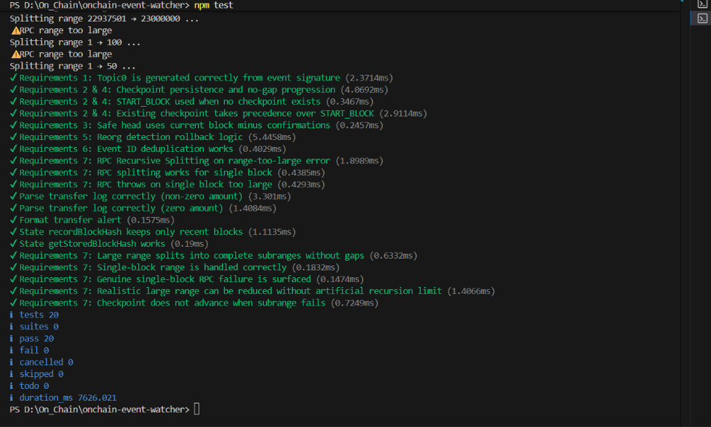
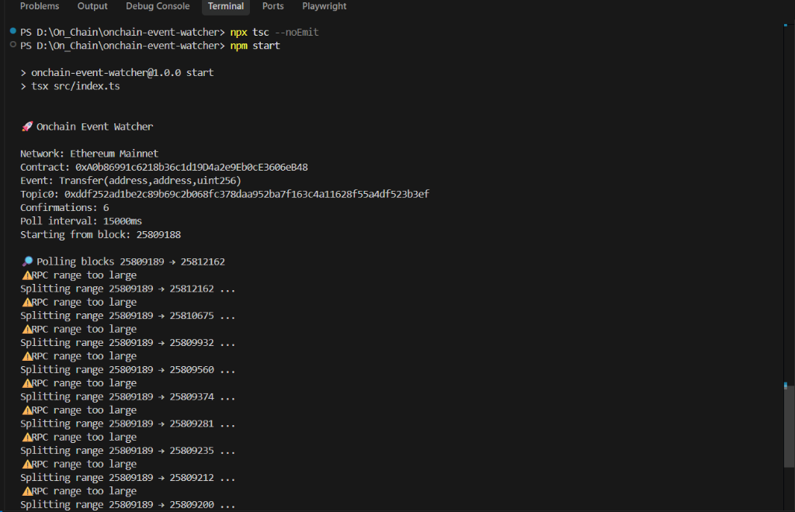
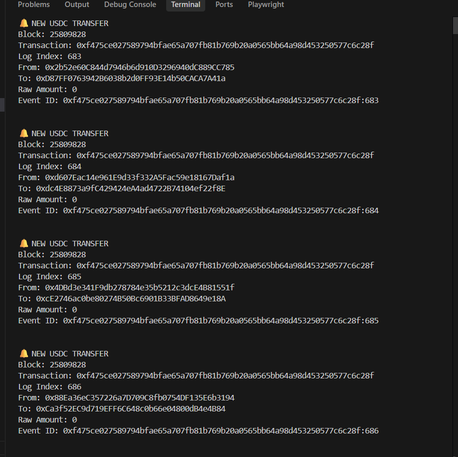

# Onchain Event Watcher 🚀 (Road to Devcon)

A reliable, reorg-safe CLI watcher designed for the "Road To Devcon - I Ethereum build challenge", Problem 3: *The Alert That Fired Twice (Or Never)*. 

It monitors Ethereum Mainnet specifically listening to the USDC token `Transfer` events while handling node constraints, avoiding duplicates, and elegantly tracking chain progression.

## 🏗️ Architecture & Workflow

```text
Current chain head
       ↓
Confirmation buffer
       ↓
Safe block range
       ↓
eth_getLogs with topic0
       ↓
Parse matching events
       ↓
Deduplicate using txHash:logIndex
       ↓
Persist checkpoint
       ↓
Next polling cycle
```

## ✅ Challenge Requirements

This implementation explicitly fulfills all eight requirements of the challenge:
* Event signature hashed into `topic0`
* Persistent last-processed block
* Real chain-head based polling
* Gap-free block progression
* Confirmation/reorg safety
* Persistent event deduplication
* Recursive large-range splitting
* No committed credentials

## ✅ Verification

### Test Suite

20 automated tests pass successfully.



### Live Ethereum Watcher

The watcher runs against Ethereum Mainnet and monitors USDC Transfer events using the event signature topic0, confirmation depth, persistent checkpoints, and RPC range splitting.



### Real USDC Transfer Alerts

The watcher successfully detects real `Transfer` events and generates a deterministic event ID using `transactionHash:logIndex` to prevent duplicate alerts.




## 🚀 Setup & Execution

### 1. Requirements
Ensure you have `Node.js` (v18+) and `npm` installed.

### 2. Installations
```bash
npm install
```

### 3. Environment Variables
Copy `.env.example` to `.env` and fill it in. 

*Note: The snippet below simply contains example placeholders. Do NOT insert your real API key into `.env.example` or the README.*

```env
ALCHEMY_API_KEY=your_alchemy_api_key_here
RPC_URL=https://eth-mainnet.g.alchemy.com/v2/your_alchemy_api_key_here
CONFIRMATIONS=6
POLL_INTERVAL_MS=15000
START_BLOCK=20500000
```

### 4. Running the Watcher
To run the watcher continuously:
```bash
npm start
```

### 5. Running Tests
Tests are executed natively using `node:test`:
```bash
npm test
```

## 🧠 How it works

* **`eth_blockNumber`**: Polled dynamically every cycle to assess the absolute real Ethereum chain head.
* **Confirmation Depth**: A stable configurable buffer subtracted natively from the chain head (`safeHead = currentHead - CONFIRMATIONS`). The watcher ignores the active unconfirmed tip.
* **`eth_getLogs`**: The targeted RPC mechanism utilized for efficient filtering rather than pulling manual bulk block data.
* **Event signature/topic0**: The `Transfer(address,address,uint256)` string represents the raw event signature. It is hashed natively via Keccak-256 to serve exactly as the `topic0` lookup filter natively.
* **Checkpoint Persistence**: Saves the absolute integer representing the `lastProcessedBlock` dynamically utilizing atomic disk mechanisms toward `data/checkpoint.json`. Ensures successive boots resume without gaps.
* **Duplicate Detection**: It assigns deterministic tracking using `${log.transactionHash}:${log.index}` mapping. This strictly prevents duplicate alerts during reprocessing, retries, and restarts by persistently tracking event identifiers securely.
* **Reorg Handling**: Continuously records small caches of canonical block hashes. During subsequent queries, checks backwards ensuring recorded hashes still align equivalently with the source chain. Initiates graceful rollbacks accurately if un-alignment/reorg is detected.
* **Range Splitting**: To avoid timeout crashes elegantly, the RPC recursively splits rejected block ranges into smaller sub-ranges until the RPC accepts them, while preserving complete block coverage flawlessly.

## 🔐 Security

* API credentials are automatically securely loaded iteratively from environment variables natively.
* `.env` is comprehensively ignored securely by Git (`.gitignore`).
* `.env.example` behaves simply containing non-operational placeholders only.
* No private keys are tracked, constructed nor used programmatically anywhere.
* The watcher performs entirely as a read-only instance cleanly and does not strictly interact, sign, nor submit blockchain transactions anywhere.

## ⚙️ Startup Behavior (Checkpoint / START_BLOCK Precedence)

The watcher determines its starting block using this precedence:

1. **Existing production checkpoint** (`data/checkpoint.json`) — If a valid checkpoint exists, the watcher resumes from `lastProcessedBlock + 1`. This is the normal restart behavior.
2. **`START_BLOCK` environment variable** — If no checkpoint exists but `START_BLOCK` is set, the watcher begins at `START_BLOCK - 1` so the first poll processes up to the safe head.
3. **Safe default** — If neither exists, the watcher starts at `safeHead - 1` (current chain head minus confirmations) to avoid scanning from genesis.

> **Important**: Unit tests use isolated temporary state files (`test-checkpoint.json`, `test-seen-events.json`) and **never** write to the production `data/checkpoint.json` or `data/seen-events.json`. Running `npm test` will not pollute your production checkpoint.